# Assignment 2: Data Structures and Performance Analysis

**Student:** Marat Aruzhan  
**Group:** SE-2525

## 1. Implementation and experimental setup

This project implements three integer data structures: DynamicArray,
MyLinkedList, and MinHeap. DynamicArray doubles its capacity when full.
MyLinkedList is a singly linked list with head and tail references.
MinHeap stores a binary min-heap in a growing array.

The list implementations provide append, indexed insertion, indexed
removal, indexed access, and value search. MinHeap provides insert,
peekMin, extractMin, and bottom-up buildHeap.

Invalid list indices throw IndexOutOfBoundsException. Accessing or
extracting the minimum of an empty heap throws IllegalStateException.
Standard Java collections are used as reference implementations in
tests, not as storage inside the implemented structures.

Experiments were performed on Windows 11, amd64, using OpenJDK 25.0.1.
The project uses Maven and JUnit 5. Python and Matplotlib generate plots
from the saved CSV files.

Input sizes are 100, 1,000, 10,000, and 100,000. Random inputs use seed 42.
Each benchmark case has five warm-up runs followed by five measured runs.
The reported time is the median of the five measurements.

System.nanoTime measures the workload. Input generation and correctness
checks are outside the timed section. For W1–W3, initial list population
is also outside the timed section. Counters are reset before measurement.
Checksums are consumed through a volatile field.

For W1–W3, both lists receive the same permutation of integers
0 through n - 1, shuffled using Random(42). Successful search
queries use values from this range; unsuccessful queries use
values from n through 2n - 1.

| Workload | Operations |
|---|---|
| W1 | 10,000 random indexed reads |
| W2 | 1,000 searches: 500 successful and 500 unsuccessful |
| W3/head | 1,000 insertion/removal pairs at index 0 |
| W3/middle | 1,000 insertion/removal pairs at index n / 2 |
| W4 | n heap insertions followed by n minimum extractions |

In W3, each insertion is immediately followed by removal at the same
index. Therefore, the size returns to n after every pair.

## 2. Operation counters and correctness testing

The counters describe selected operations, not every Java instruction.

- Steps count instrumented array reads or linked-list traversals.
- Moves count instrumented element copies, shifts, or link updates.
- Comparisons count comparisons between stored values and search or heap
  values; loop conditions and index checks are excluded.

The current instrumentation does not count the final write of a newly
inserted value in DynamicArray or MinHeap as a move. Heap siftDown does
count its final placement. Therefore, these counters must be interpreted
using their definitions rather than as an identical cost model for all
structures. Steps, moves, and comparisons may overlap and should not be
added together as a count of distinct machine instructions.

The test suite contains 40 passing tests. Tests cover empty structures,
invalid indices, duplicates, negative values, resizing, insertion and
removal at boundaries, and reuse after becoming empty.

Randomized list operations are checked against ArrayList. Randomized
heap operations are checked against PriorityQueue. Heap validity is
checked after mutations, and extracted values must be sorted. Separate
tests verify metric counters and their reset behavior.

## 3. Complexity analysis

Let n be the number of stored elements and i a valid index.
The table gives tight time bounds where the stated assumptions apply.
Average indexed operations assume uniformly distributed valid indices.
Average search assumes uniformly distributed successful positions or
a fixed nonzero proportion of unsuccessful searches.

| Structure and operation | Best | Average / amortized | Worst |
|---|---|---|---|
| DynamicArray append | Θ(1) | Θ(1) amortized | Θ(n) |
| DynamicArray add(i, x) | Θ(1) | Θ(n) average | Θ(n) |
| DynamicArray remove(i) | Θ(1) | Θ(n) average | Θ(n) |
| DynamicArray get(i) | Θ(1) | Θ(1) | Θ(1) |
| DynamicArray contains(x) | Θ(1) | Θ(n) average | Θ(n) |
| MyLinkedList append | Θ(1) | Θ(1) | Θ(1) |
| MyLinkedList add(i, x) | Θ(1) | Θ(n) average | Θ(n) |
| MyLinkedList remove(i) | Θ(1) | Θ(n) average | Θ(n) |
| MyLinkedList get(i) | Θ(1) | Θ(n) average | Θ(n) |
| MyLinkedList contains(x) | Θ(1) | Θ(n) average | Θ(n) |
| MinHeap insert | Θ(1) | O(log n) amortized upper bound | Θ(n) with resizing |
| MinHeap peekMin | Θ(1) | Θ(1) | Θ(1) |
| MinHeap extractMin | Θ(1) | Θ(log n) under typical random-key assumptions | Θ(log n) |
| MinHeap buildHeap | Θ(n) | Θ(n) | Θ(n) |

A heap insertion without resizing has worst-case time Θ(log n).
The average insertion cost depends on the input distribution; it is
not necessarily Θ(log n). Resizing can make an individual insertion
linear, while its resizing cost is constant amortized.

DynamicArray indexed insertion shifts n - i elements. Removal shifts
n - i - 1 elements. MyLinkedList get(i) traverses i links. Insertion at
the head or tail is constant time, but insertion in the middle requires
finding the predecessor. Removing the tail is linear because this
singly linked list must locate its predecessor.

All size and metric getter methods, and resetMetrics, take Θ(1) time.

All three structures use Θ(n) storage when populated from empty by
insertion. DynamicArray and MinHeap retain their capacity after removal,
so their storage is more precisely Θ(capacity), even if the current
size becomes small.

List reads, searches, removals, and non-resizing array insertions use
Θ(1) auxiliary space. Linked-list insertion allocates one node.
Array and heap growth allocate Θ(n) additional space. Heap extraction
uses Θ(1) auxiliary space because siftDown is iterative. buildHeap
allocates a new Θ(n) backing array and uses Θ(1) working space beyond it.

## 4. Correctness proofs using loop invariants

### 4.1 DynamicArray indexed insertion

Consider the right-shift loop in add(index, x). Let A be the array
contents before shifting and let s be the original size.

**Invariant:** At the start of an iteration with loop variable i,
every position k with i < k <= s contains A[k - 1], while positions
0 through i retain their original values wherever those original
positions exist.

**Initialization:** Initially i = s. The shifted range is empty, and
all original elements remain unchanged.

**Maintenance:** The assignment data[i] = data[i - 1] copies the next
original element into its required position. Because shifting proceeds
from right to left, the source has not been overwritten. Decreasing i
preserves the invariant.

**Termination:** The loop stops when i = index. Positions index + 1
through s now contain the original suffix shifted right by one.
The prefix before index is unchanged.

**Conclusion:** Writing x at index and increasing size inserts exactly
one element while preserving the order of all original elements.
Resizing, when necessary, first copies all original elements and
provides enough capacity for the shift.

### 4.2 MyLinkedList indexed access

Consider the traversal loop in get(index).

**Invariant:** At the start of iteration i, current points to the
node at position i in the original list.

**Initialization:** Before the first iteration, i = 0 and current
equals head, which is the node at position 0.

**Maintenance:** Assigning current = current.next moves to position
i + 1. Incrementing i therefore preserves the invariant.

**Termination:** The loop ends when i = index, so current points to
the requested node.

**Conclusion:** Returning current.value returns the value at the
requested index. The bounds check guarantees that this node exists.

## 5. Experimental results

CSV files contain the measured values. Timing plots use logarithmic
axes. Positive operation counters also use logarithmic axes; panels
whose counters are all zero display zero explicitly.

### W1: Indexed access

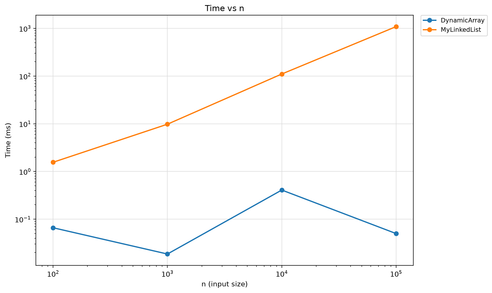

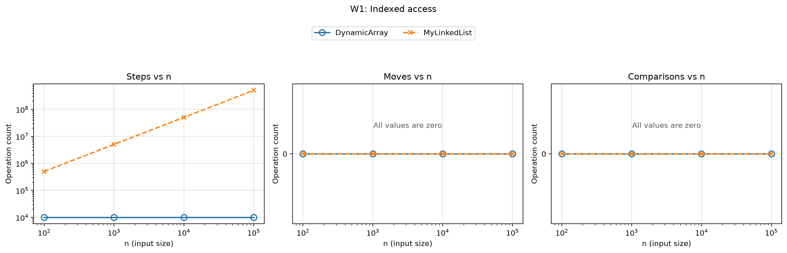

DynamicArray performs exactly 10,000 counted reads at every input size.
MyLinkedList performs 502,489,208 traversals at n = 100,000.

### W2: Value search

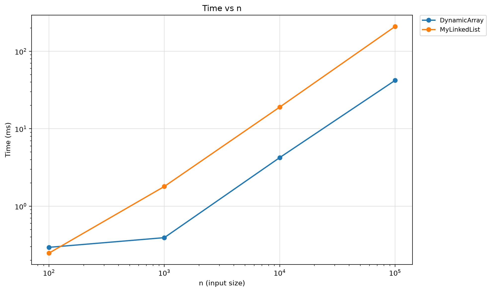

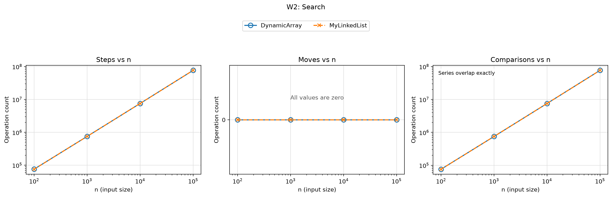

Both structures perform the same value comparisons for the same
queries. At n = 100,000, each performs 74,743,734 comparisons.

### W3: Indexed insertion and removal

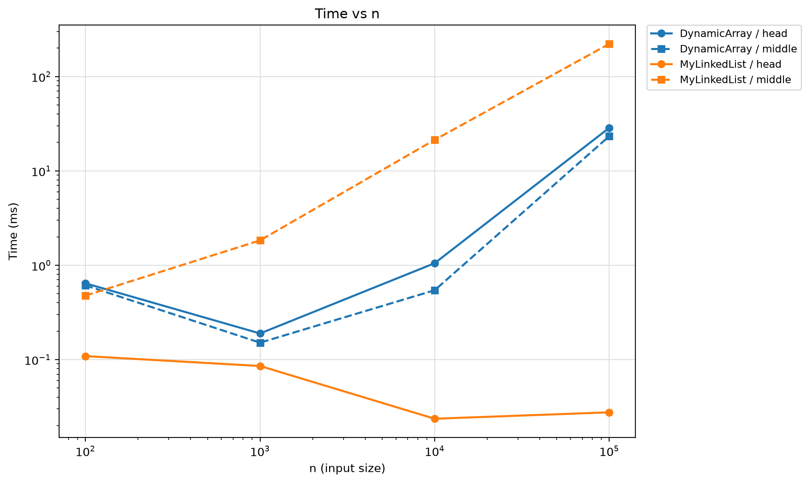

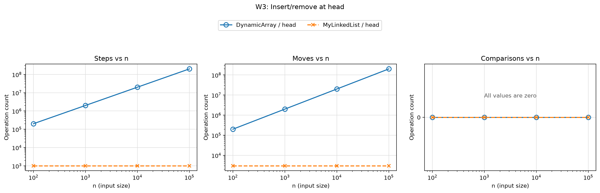

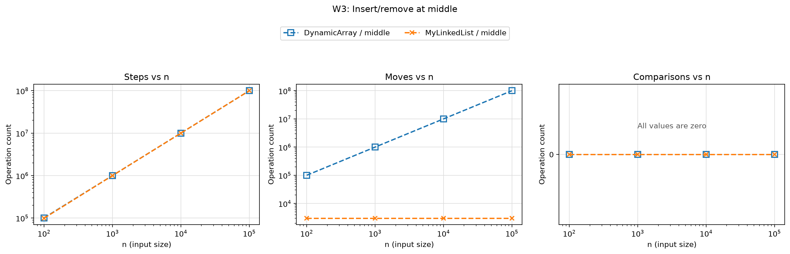

For head operations, MyLinkedList uses 1,000 steps and 3,000 link
updates at every tested size. DynamicArray shifts 200,000,000 elements
at n = 100,000. Middle operations require traversal in MyLinkedList
and shifting in DynamicArray.

### W4: Heap operations

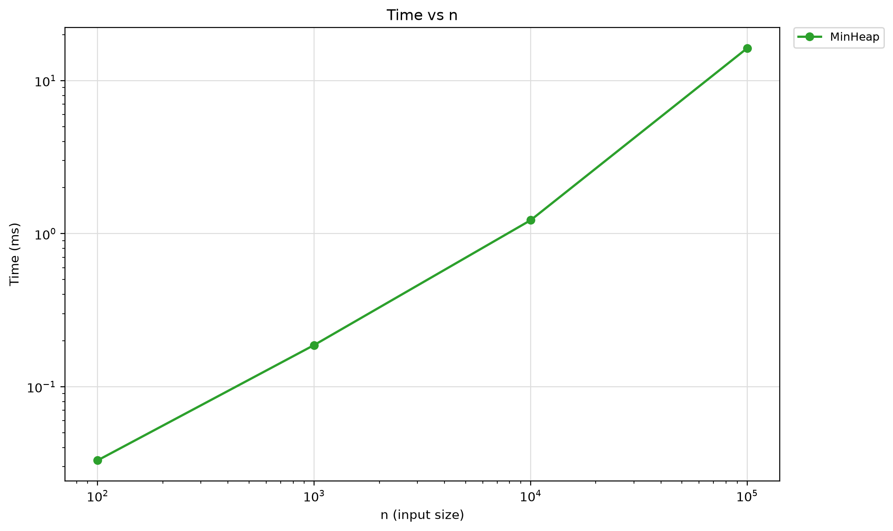

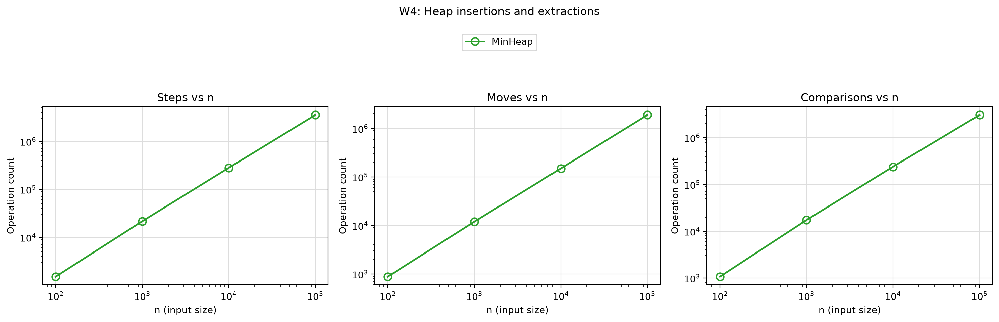

At n = 100,000, the insertion/extraction workload takes 12.7737 ms
and performs 3,059,283 value comparisons. The extracted sequence is
checked against a sorted copy of the input.

### Discussion

1. W1 confirms that array indexed access requires a constant number
   of operations per query.
2. Linked-list indexed access becomes more expensive because reaching
   an index requires traversing preceding nodes.
3. W2 has identical comparison counts because both structures scan
   the same ordered values for the same queries.
4. The array is faster in the large search cases, which is consistent
   with contiguous storage and better cache locality.
5. Linked-list traversal requires dependent pointer reads and may
   access nodes located in different memory regions.
6. In W3/head, the linked list changes a constant number of links
   regardless of its size.
7. The array must shift existing elements when inserting or removing
   at the beginning.
8. In W3/middle, the linked list must first traverse to the predecessor,
   so its operation cost grows with n.
9. The array can still be faster in the middle workload because
   sequential memory access has lower practical overhead than pointer
   traversal in these measurements.
10. W4 is consistent with O(n log n) total work for n heap insertions
    and n extractions, although four measured sizes alone do not prove
    an asymptotic bound.
11. The nonmonotonic short timings in W1 and W3 can reflect JVM
    compilation, runtime optimization, and measurement noise; they
    do not imply improving asymptotic complexity.
12. Five warm-up runs and median timings reduce some variability but
    do not eliminate all benchmarking limitations.
13. Node allocation can create garbage-collection pressure, although
    these experiments do not separately measure GC time.
14. Arrays suit indexed access, linked lists suit frequent head
    updates, and heaps suit repeated retrieval of the minimum.

## 6. Bonus: Bottom-up heap construction

Floyd buildHeap copies the input and processes internal nodes from
the last parent back to the root using siftDown.

Most nodes are close to the leaves and require little downward work.
The total work is bounded by a sum proportional to
n × Σ(h / 2^h), which is O(n). Copying the input requires Ω(n),
so this implementation has Θ(n) construction time.

Repeated insertion has Θ(n log n) worst-case construction time.
Descending distinct inputs expose this behavior because each newly
inserted value rises to the root. Random inputs can require much
less upward movement, so their results should not be described as
demonstrating the worst case.

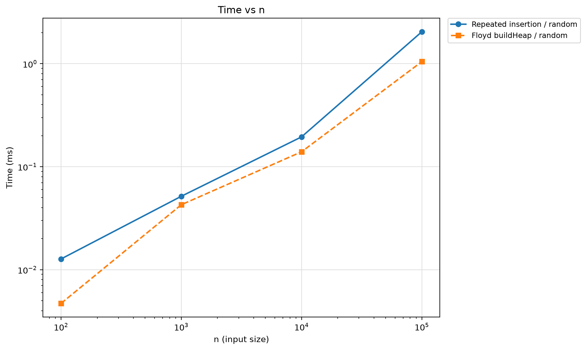

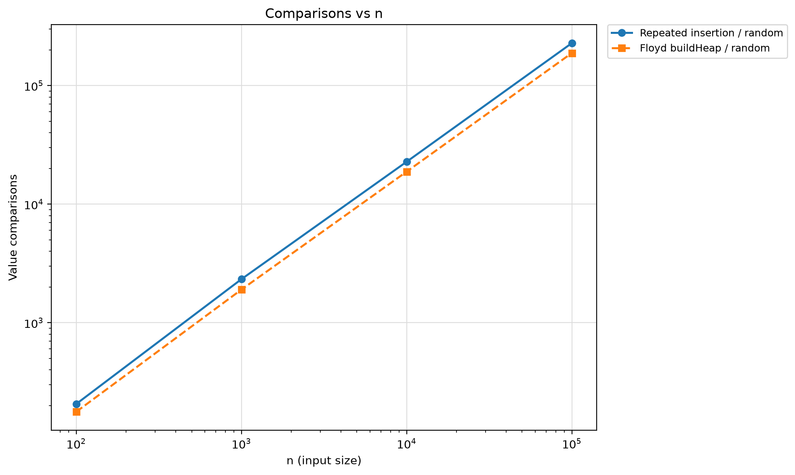

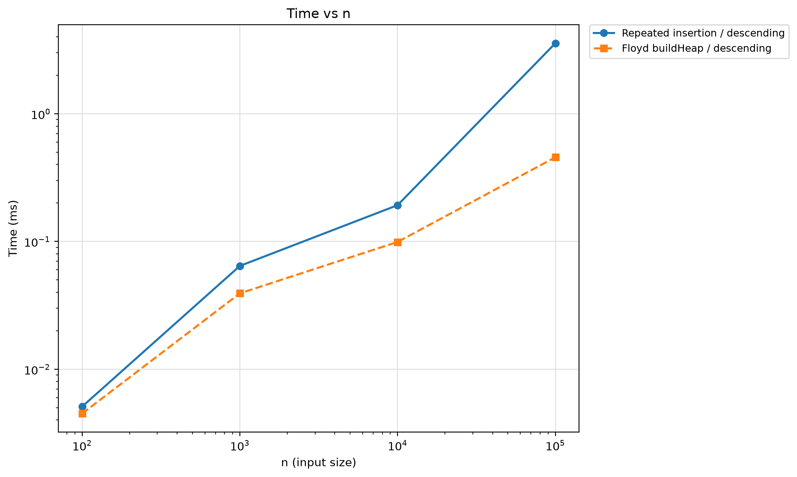

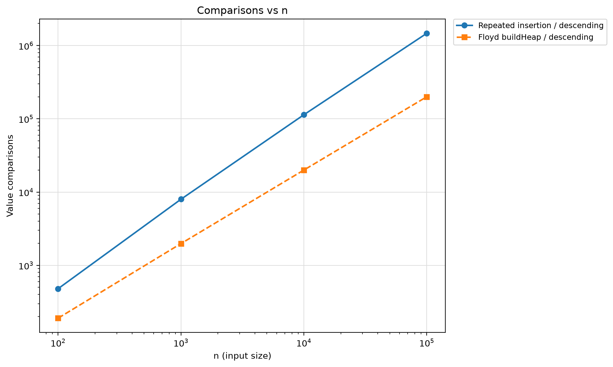

At n = 100,000 with descending input, repeated insertion performs
1,468,946 comparisons, while Floyd construction performs 199,978.
Measured times are 3.5609 ms and 0.4564 ms respectively, making Floyd
approximately 7.8 times faster in this particular run.

These timings include backing-array allocation and copying where
performed by the construction method. Heap validity and extracted
values are checked outside the timed region.

## 7. Bonus: Memory measurement with JOL

JOL 0.17 GraphLayout measures the total footprint of each structure
and the objects reachable from it.

The measured JVM uses compressed references and 8-byte object alignment.
Detailed VM information and object footprints are saved in
results/jol_vm.txt and results/jol_footprints.txt.

| n | DynamicArray bytes | MyLinkedList bytes | MinHeap bytes |
|---|---:|---:|---:|
| 100 | 704 | 2,448 | 704 |
| 1,000 | 5,184 | 24,048 | 5,184 |
| 10,000 | 41,024 | 240,048 | 41,024 |
| 100,000 | 655,424 | 2,400,048 | 655,424 |

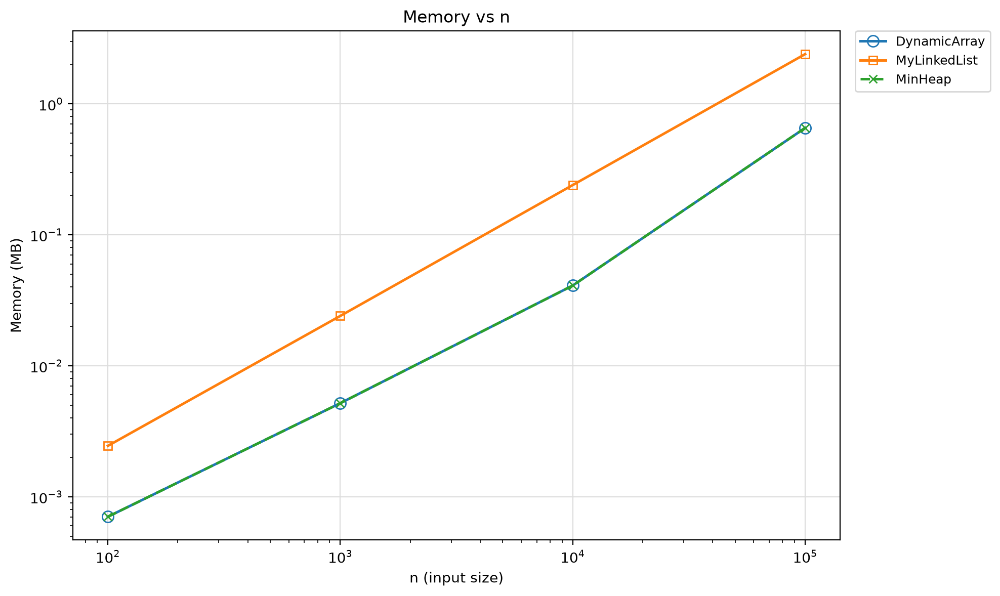

The linked list requires a separate node object for every element.
In this JVM configuration, its measured footprint follows
48 + 24n bytes.

DynamicArray and MinHeap have matching footprints because their
backing arrays have the same capacity and their wrapper objects have
the same measured size. Their footprint follows
64 + 4 × capacity bytes in this configuration.

Doubling leaves unused capacity, explaining why bytes per stored
element vary with n. At n = 100,000, the linked list occupies about
3.66 times as much memory as either array-based structure.

These values describe reachable object footprints in this JVM.
They are not measurements of total process memory or universal
object sizes across all JVM configurations.